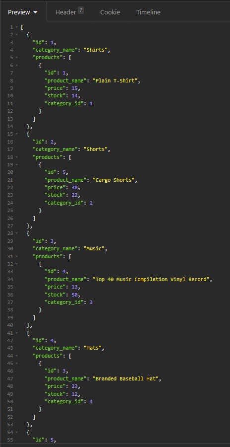
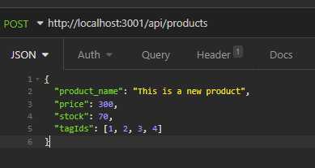

# E-commerce back-end [](https://opensource.org/licenses/MIT)

## Description
A sample back-end of an e-commerce site. The db contains four tables, products, tags, categories and productTags. The relationship between the tables are as follows: A category has many products but a product can only belong to one category. A product has many tags and a tag has many products. All CRUD operations are listed for all the tables.

## Table of Contents
- [Installation](#installation)
  
- [Usage](#usage)
  
- [License](#license)
  
- [Contributing](#contributing)
  
- [Questions](#questions)

## Retrieving all categories


## Creating a product


## Installation
To install the necessary dependencies, run the following command:
```
  npm i
```

## Usage
### Creating the database
 - Open the command prompt and navigate to the root dev directory (Where the server.js file is located)
 - Log onto mysql (```mysql -u [user] -p```) and type your password when prompted
 - Type ```source db/schema.sql```. This creates the tables
 - After that, quit out of mysql and type ```npm run seed```. This will create some sample data for all the tables
 
### Starting the application
- Once the database is setup, you can just navigate back to the root dev folder and type ```npm start```
- If you are adding to the application, you can use ```npm run watch``` which will restart the server every time you save a js file
- The application will be running on ```http://localhost:3001``` in which case you can use ```http://localhost:3001/api/products``` as an example to retrieve results

## License
This project is licensed under the [MIT](https://opensource.org/licenses/MIT) license

## Contributing
This work is most likely not going to be continued to be worked on. You are free to fork it and make your own changes

## Questions
If you have any questions about the repo, open an issue or contact me directly at seangenge@gmail.com. You can find more of my work at [seangenge](https://github.com/seangenge).

## Video of application in work
https://watch.screencastify.com/v/o1BTddMD0h8nkgxNYz5F